# Activity 的生命周期及 Intent

---

## 实验目的

1. 掌握 `Activity` 组件生命周期函数的用法

2. 掌握使用 `intent` 实现 `Activity` 之间的跳转

3. 掌握在 `manifest.xml` 文中定义多个 `Activity`，并指定`Launcher Activity`

4. 掌握 `Activity` 的启动模式，和启动模式所对应的 `Activity` 和 `Task` 的关系

## 实验开发环境和工具

- OS：Windows 10

- IDE：Android Studio

- 编程语言：Java

## 实验要求

1. 设计如下界面，包括四个按钮，两个文本框。单击对应按钮可以启动对应 Activity。假定 Activity A 为启动 Activity。具体如图如下所示

    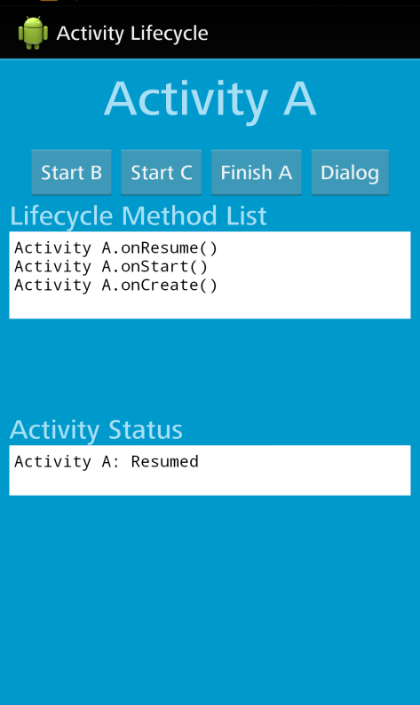

    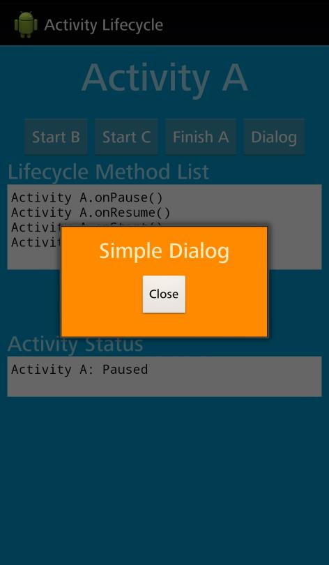

    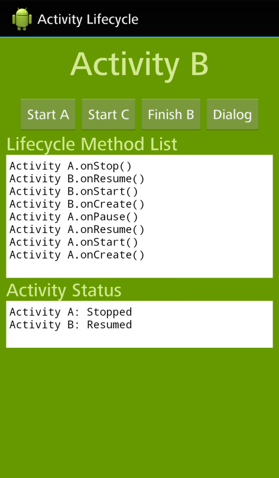

    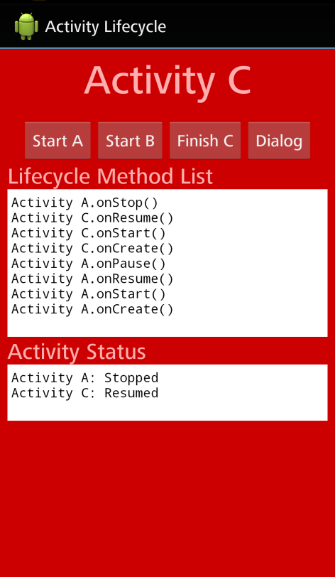

2. 修改 Activity 的启动模式（LaunchMode），并通过 Log 信息来体会不同启动模式所对应的 Activity 和 Task 的关系

## 实验内容

### 问题描述

从上面的内容可知，我们开发的 APP 将包含 3 个 Activity，每个 Activity 除了在样式（style）上的差距外，有着相同的功能和界面布局。每个 Activity 包含 4 个按钮，功能如下：

- 启动其他 Activity（2 个）；

- 结束当前 Activity（1 个）；

- 打开一个 Dialog（1 个）。

同时，每个 Activity 包含 2 个 TextView 组件，分别用来显示：

- 与 3 个 Activity 的生命周期（Lifecycle）有关的方法的调用记录（Log），

- 当前 3 个 Activity 的状态。

### 设计简要描述

#### 按钮功能

##### 启动其他 Activity

在 Activity 中定义 `startXByY` 方法（`X` 为要启动的 Activity，`Y` 为启动者），方法使用 `intent` 启动其他 Activity。例如：Activity A 中启动 Activity B 的代码：

```java
/// file: A.java

/**
 * Callback 函数，调用 Activity B
 * @param view 与函数绑定在一起的 View
 */
public void startBByA(View view) {
    Intent intent = new Intent(this, B.class).putExtra(Activities.EXTRA_CALLER, ID);
    startActivity(intent);
}
```

在 Activity 对应的 Layout 文件内将 `onClick` 属性设为对应方法。例如：绑定上面给出的代码：

```xml
<!-- file: activity_a.xml -->

<Button
    android:onClick="startBByA"
    android:text="@string/start_b"
    android:textAllCaps="false"
    android:layout_width="wrap_content"
    android:layout_height="wrap_content"/>
```

##### 结束当前 Activity

在 Activity 中定义 `finishX` 方法（`X` 为当前 Activity），使用 `finish` 结束当前 Activity：

```java
/// file: A.java

/**
 * Callback 函数，调用 finish()
 * @param view 与函数绑定在一起的 View
 */
public void finishA(View view) {
    finish();
}
```

同样，绑定到对应按钮的属性：

```xml
<!-- file: activity_a.xml -->

<Button
    android:onClick="finishA"
    android:text="@string/finish_a"
    android:textAllCaps="false"
    android:layout_width="wrap_content"
    android:layout_height="wrap_content"/>
```

##### 启动 Dialog

> 此代码在调试阶段经过更改，最终代码见：调试报告

跟上面的两种按钮一样，使用方法（method）绑定到属性的方法。

```java
/// file: A.java

/**
 * Callback 函数，调用一个 Dialog
 * @param view 与函数绑定在一起的 View
 */
public void startDialog(View view) {
    AlertDialog alertDialog = new AlertDialog.Builder(this).create();
    alertDialog.setTitle("Dialog");
    alertDialog.setMessage("Just a Dialog");
    alertDialog.show();  
}
```

```xml
<!-- file: activity_a.xml -->

<Button
    android:onClick="startDialog"
    android:text="@string/Dialog"
    android:textAllCaps="false"
    android:layout_width="wrap_content"
    android:layout_height="wrap_content"/>
```

#### 记录信息的功能

##### Lifecycle Method 的调用记录

因为在课堂上使用 `Log.d` 方法记录过生命周期方法的调用过程，并使用 `logcat` 获取 Log 来学习整个过程。所以考虑在 Runtime 读取 `logcat` 的 Log：

```java
/// file: Activities.java

/**
 * 从 logcat 获得 Log 信息
 * @return 包含 Log 信息的 String，每个 Log 信息被 newline 分隔
 */
public static String getLog() {
    try {
        // 调用 Process 执行 Command
        Process process = Runtime.getRuntime().exec("logcat -d");
        // 对结果建立流
        BufferedReader bufferedReader = new BufferedReader(
                new InputStreamReader(process.getInputStream()));

        // StringBuilder 是可变的字符串（mutable）
        StringBuilder log = new StringBuilder();
        String line;
        // 读取下一行 Log，直到 EOF
        while ((line = bufferedReader.readLine()) != null) {
            // 如果 Log 包含 TAG
            if (line.contains(TAG)) {
                // 精简 Log 信息，因为 readLine() 不包含 newline，所以手动添加
                String reducedLog = line.substring(line.indexOf(TAG) + TAG.length() + 1) + '\n';
                // 将 Log 插到原有 Log 的头部，以保持时间降序排序
                /// @warning 可以用 LinkArray 优化
                log.insert(0, reducedLog);
            }
        }
        return log.toString();
    } catch (IOException e) {
        e.printStackTrace();
    }
    return "failed to read from logcat";
}
```

在每个生命周期方法内先调用 `Log.d` 记录当前状态，之后调用 `updateLogToView` 将 Log 更新到对应 TextView 内。

```java
/// file: Activities.java

/**
 * 更新 TextView 中的 Log 信息
 */
public static void updateLogToView(TextView lifecycleMethodList) {
    lifecycleMethodList.setText(getLog());
}
```

##### 当前各 Activity 的状态

这个功能涉及在 3 个 Activity 内共享数据，可以对上一步获取的 Log 进行处理（将 Activity 最新调用的 Method 提取为状态），也可以使用一个专门保存状态数据为静态变量的类来实现，但是 Android 事实上提供了专门的数据结构：`SharedPreferences`。`SharedPreferences` 提供键值对的数据结构，可以在**持久化**（persistent）保存。

在每个生命周期函数内，保存当前状态：

```java
// 存入当前状态到 SharedPreferences 内
SharedPreferences preferences = getSharedPreferences(Activities.PREFERENCES_NAME, MODE_PRIVATE);
SharedPreferences.Editor editor = preferences.edit();
editor.putString(ID, ID + ": " + state);
editor.apply();
```

同时读取各个 Activity 当前的状态：

```java
// 从 ShredPreferences 中获取当前各 Activities 的状态，并更新对应 View
SharedPreferences preferences = getSharedPreferences(Activities.PREFERENCES_NAME, MODE_PRIVATE);
String initStatuses = "";
initStatuses = initStatuses + preferences.getString("A", "null") + '\n';
initStatuses = initStatuses + preferences.getString("B", "null") + '\n';
initStatuses = initStatuses + preferences.getString("C", "null") + '\n';
mActivityStates.setText(initStatuses);
```

### 程序清单

- `A.java/B.java/C.java`：Activity A、B、C 的实现

- `activity_a.xml/activity_b.xml/activity_c.xml`：对应 Activity 的 Layout 文件

- `Activities.java`：提供在 3 个 Activities 间通用的静态方法，和静态常量

- `MyDialog.java`：以 Dialog 的样式调用的 Activity

- `activity_mydialog.xml`：对应 Activity 的 Layout 文件

- `colors.xml/strings.xml`：常量文件

### 调试报告

#### 持久化存储的问题

因为 SharedPreferences 是**持久化**存储的，所以在 APP 退出后以前的数据也会保存，导致在刚启动的时候会显示尚未创建的 Activity 是 destroyed 状态（因为在 APP 退出时，所有 Activity 都会被 Destroy）：


##### 解决方法

Activity 之间在调用时，增加 Intent 上的附加数据（extra）`caller`，标记是谁调用的 Activity。这样系统调用 Activity A 和其他 Activity 调用 Activity A 就可以区分开来了。之后，在 Activity A 启动时判断是否 Intent 中有 `caller` 这一附加数据，如果没有，就先将 SharedPreferences 中的数据都清空。

```java
/// file: A.java

// 如果由系统调用，而不是由其他 Activity 调用
if (getIntent().getStringExtra(Activities.EXTRA_CALLER) == null) {
    // 清除 SharedPreferences 的数据
    getSharedPreferences(Activities.PREFERENCES_NAME, MODE_PRIVATE).edit()
        .putString("A", "null")
        .putString("B", "null")
        .putString("C", "null")
        .apply();
}
```

现在 Activity Status 在刚启动 APP 时的显示是正常的：


#### Dialog 不会导致 Activity Pause

事实上，Dialog 是不会导致 Activity 进入 Pause 状态的：

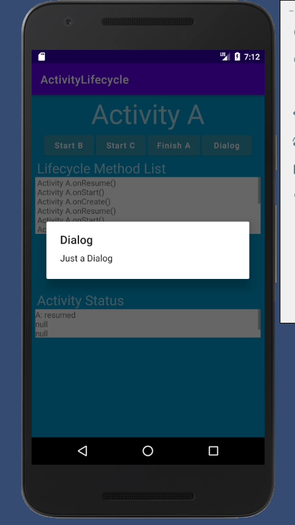

##### 解决方法

启动 Activity 是会导致当前 Activity Pause 的，我们可以将 Dialog 的 Theme 赋给一个 Activity，让它假装是个 Dialog。

创建 MyDialog Activity，在 `AndroidManifest.xml` 中编辑：

```xml
<!-- file: AndroidManifest.xml -->

<activity android:name=".MyDialog"
    android:label="Dialog"
    android:theme="@android:style/Theme.Dialog"/>
```

更改 `startDialog`：

```java
/**
 * Callback 函数，调用一个 MyDialog
 * @param view 与函数绑定在一起的 View
 */
public void startDialog(View view) {
    startActivity(new Intent(getApplicationContext(), MyDialog.class));
}
```

现在启动 Dialog（伪）会导致 Activity 暂停：

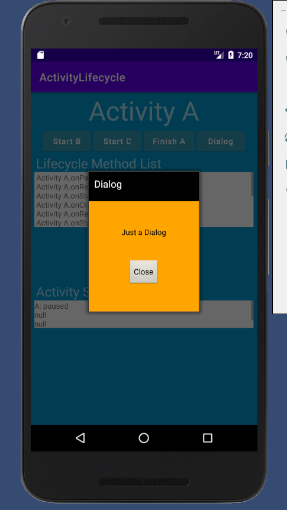

#### Activity 的状态更新存在延迟

TextView 内的信息存在延迟，例如：

在初始界面点击 `Start B` 后，`logcat` 记录的结果是：

```java
D/Activity_TAG: Activity A.onCreate()
D/Activity_TAG: Activity A.onStart()
D/Activity_TAG: Activity A.onResume()
D/Activity_TAG: Activity A.onPause()
D/Activity_TAG: Activity B.onCreate()
D/Activity_TAG: Activity B.onStart()
D/Activity_TAG: Activity B.onResume()
D/Activity_TAG: Activity A.onStop()
```

但在 Lifecycle Method List 内**缺失**了 `A.stop()`。而 Activity Status 内 Activity A 的状态也还是 `Activity A: paused`。同样的情况还包括点击 `Finish B` 后， Lifecycle Method List 缺失 `B.stop()` 和 `B.destroy()`。

##### 问题原因

`A.stop` 是在 `B.resume` 调用后才调用的，而在 `B.resume` 调用时，Activity A 确实还是 Pause 状态，而在 `A.stop` 时更新的信息虽然被保存了，但是并没有及时的更新到 Activity B 中的 TextView 而是 Activity A 自己的 TextView，这就是延迟产生的原因。

##### 解决方法

使用工作线程在后台轮询被保存的数据，不断用读取到的数据更新 TextView。

但是，由于 Android 自身的设计，只有主线程才可以与 View 交互，只有工作线程才可以执行高延迟的 I/O 操作（比如建立网络连接）。当然 Android 提供在两者间通信的方法 `Handle`，它提供了 UI 线程（主线程）和工作线程间消息队列的包装 [Reference](https://developer.android.com/reference/android/os/Handler)。

**重构代码**，将每个生命周期方法中的更新 TextView 的代码和保存状态的代码分开，封装成两个方法：

```java
/// file: A.java

/**
 * 更新当前 Views 中的信息
 */
private void updateViews() {
    // 从 ShredPreferences 中获取当前各 Activities 的状态，并更新对应 View
    SharedPreferences preferences = getSharedPreferences(Activities.PREFERENCES_NAME, MODE_PRIVATE);
    String initStatuses = "";
    initStatuses = initStatuses + preferences.getString("A", "null") + '\n';
    initStatuses = initStatuses + preferences.getString("B", "null") + '\n';
    initStatuses = initStatuses + preferences.getString("C", "null") + '\n';
    mActivityStates.setText(initStatuses);

    // 更新 Log 信息到给定的 View
    Activities.updateLogToView(mLifecycleMethodList);
}

/**
 * 保存当前的状态和方法调用信息
 * @param state 当前的状态
 * @param methodName 调用的方法名
 */
private void saveCurrentState(String state, String methodName) {
    // 存入当前状态到 SharedPreferences 内
    SharedPreferences preferences = getSharedPreferences(Activities.PREFERENCES_NAME, MODE_PRIVATE);
    SharedPreferences.Editor editor = preferences.edit();
    editor.putString(ID, ID + ": " + state);
    editor.apply();

    // 将函数调用写入 Log 信息
    Log.d(Activities.TAG, "Activity " + ID + "." + methodName + "()");
}
```

`saveCurrentState` 方法在每个生命周期方法内执行一次。

设定工作线程在后台定时发送 Message，并启动：

```java
// 定义并启动工作线程
new Thread() {
    @Override
    public void run() {
        while (true) {
            try {
                Thread.sleep(Activities.WAIT_TIME);
            } catch (InterruptedException e) {
                e.printStackTrace();
            }
            Message msg = Message.obtain();
            msg.what = Activities.UPDATE_VIEWS;
            mHandler.sendMessage(msg);
        }
    }
}.start();
```

设定 `Handler` 每接受一次工作线程的消息就更新一次 View：

```java
// 指定 Handler 对消息的处理
new Handler() {
    @Override
    public void handleMessage(@NonNull Message msg) {
        super.handleMessage(msg);
        if (msg.what == Activities.UPDATE_VIEWS) {
            updateViews();
        }
    }
};
```

### 结果分析

#### 基本功能

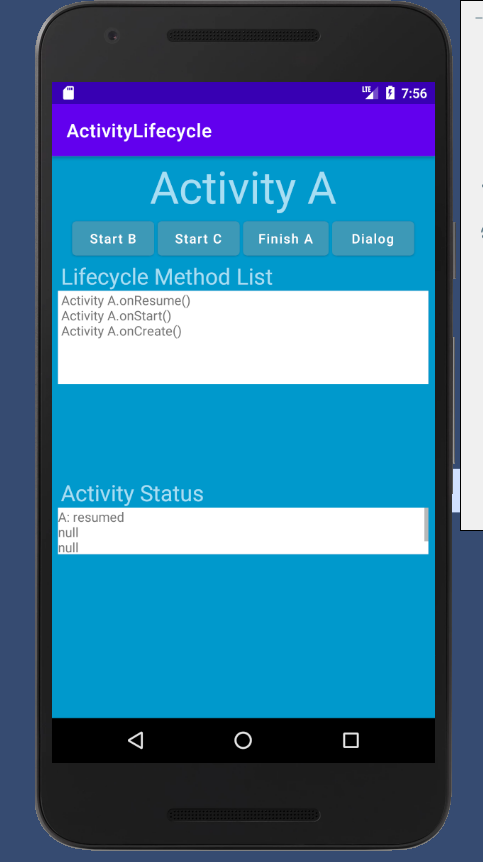

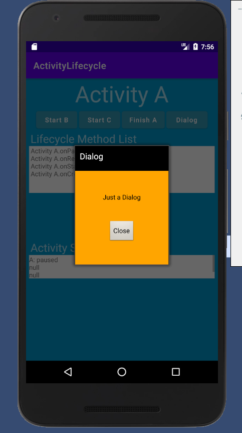

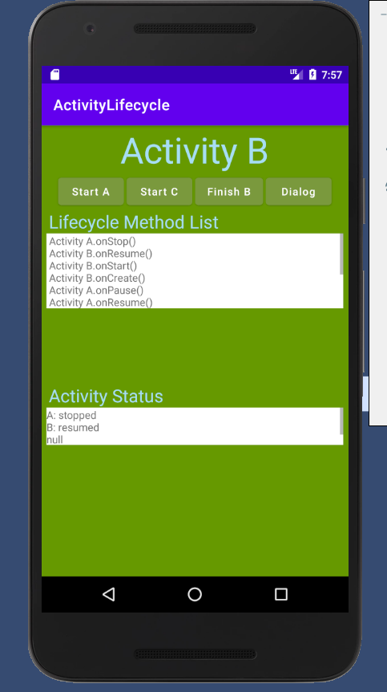

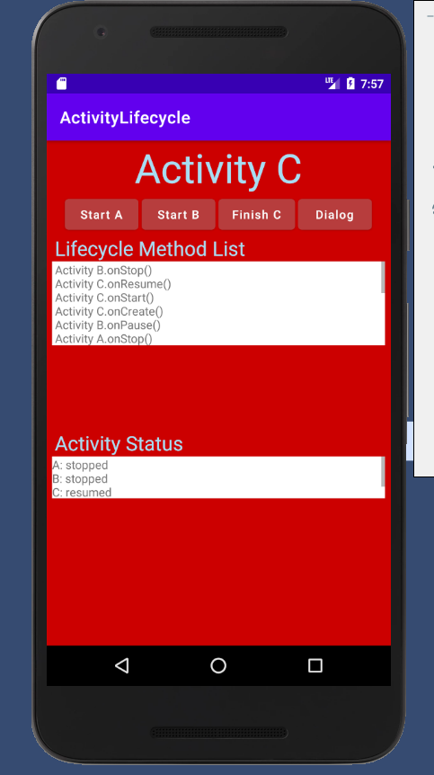

#### 切换 Launch Mode

由于 `singleTask` 和 `singleInstance` 的区别要在不同的 Task（最简单的方式：不同的 APP）演示。而 `singleTop` 和 `standard` 的区别要在 Activity 可以调用自身的情况下演示，所以这里只演示 `singleTask` 和 `standard` 的区别。

在 `AndroidManifest.xml` 内编辑：

```xml
<!-- file: AndroidManifest.xml -->
<activity android:name=".A"
    android:launchMode="singleTask"
    >
```

在起始画面内点击 `Start B`，之后点击 `Start A`：

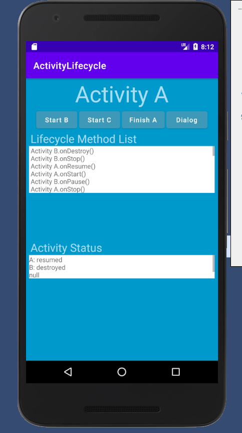

将 `launchMode` 改回 `standard`，重新执行上述操作：


可以看出，在 `singleTask` 的模式下，已经创建的 Activity 会从 Task Stack 中抽取到栈顶，而在 `standard` 的模式下，会直接创建一个新的 Activity 放到栈顶。 
